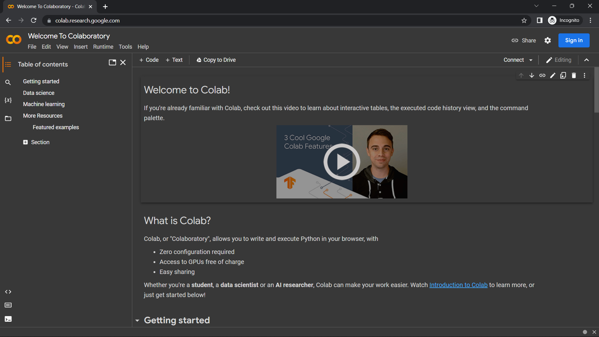
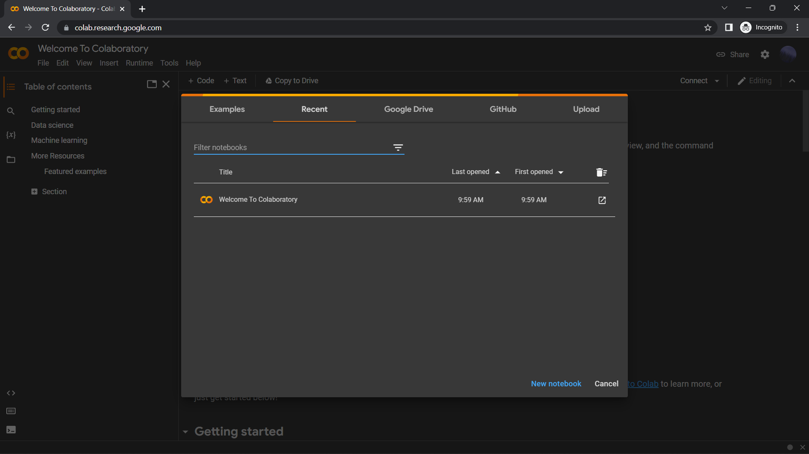
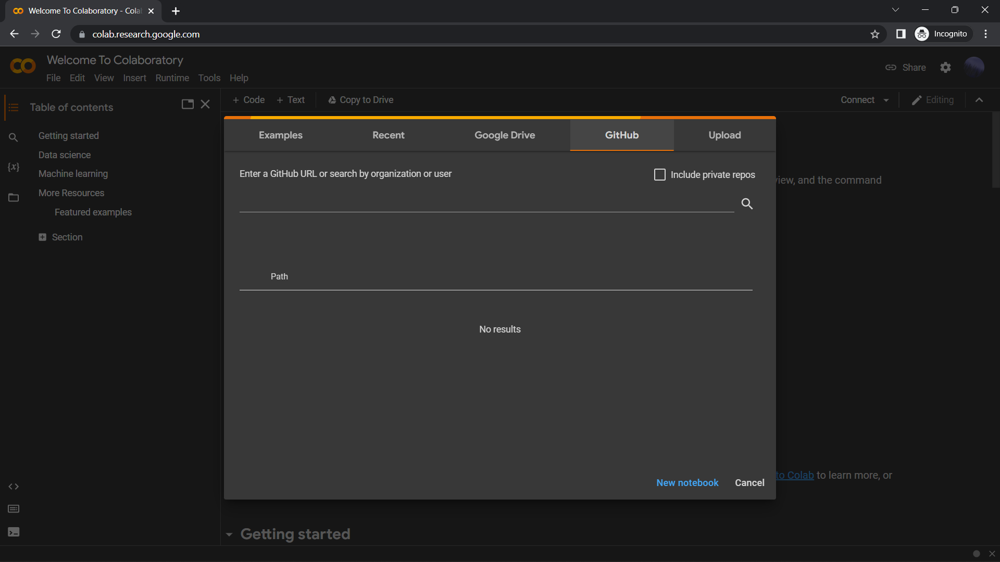
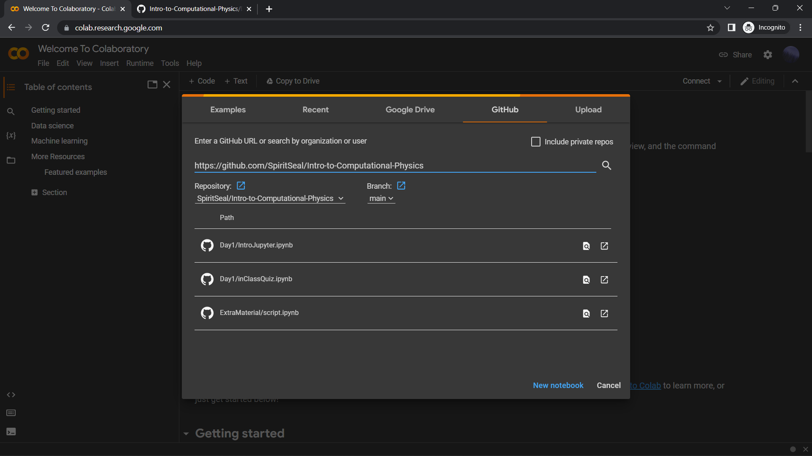
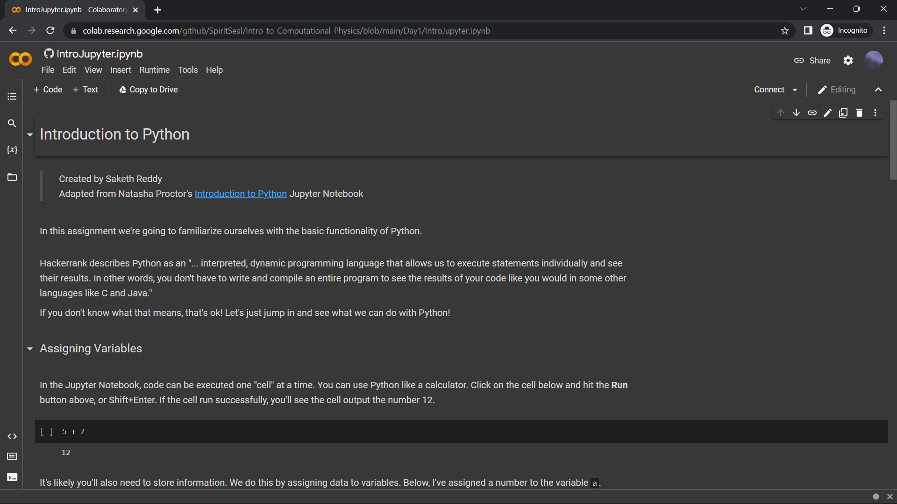

# How to setup Google Colaboratory *for Dummies™*

1. Navigate to [https://colab.research.google.com/](https://colab.research.google.com/)

2. Sign in using a Google Account. Afterwards, you should see a quickstart screen like this:

Under other circumstances, you can create an empty new notebook by using the `New Notebook` button at the bottom of the page. For this tutorial however, we will be opening an existing notebook- a Beginner Python Tutorial I put together for the purposes of this course.
3. Navigate to the `GitHub` tab of the panel.

4. Enter `https://github.com/SpiritSeal/Intro-to-Computational-Physics` into the search field.

5. Select Day1/IntroJupyter.ipynb

## Congrats! You have successfully opened the Jupyter Notebook! Follow the instructions in the notebook to learn more about how to use Python and this tool
